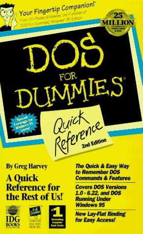
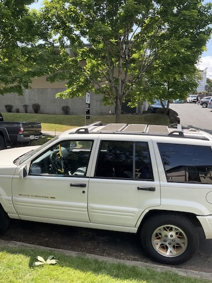
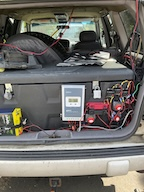
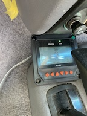
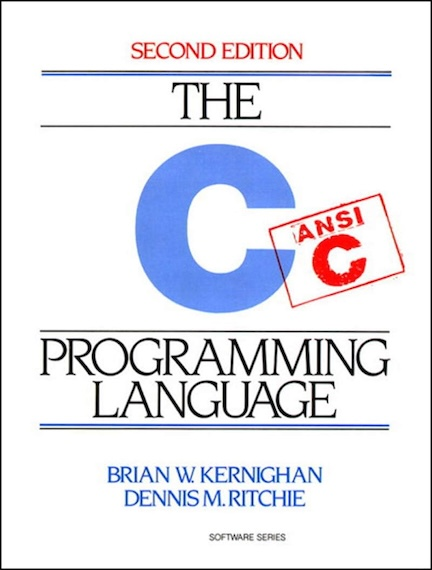

# Ruth Prudence | Testing, Development, Analysis, Design

## Bio

I am built for problem solving. I approach every challenge as an opportunity to understand the core issue (some might call this "first principles"), leveraging available resources and technologies to create sustainable solutions. If it doesn't work every time, it doesn't work.

I achieve great success by systematically improving processes, leaving people and projects better than when I arrived. Whether it's through code, documentation, mentorship, or strategic problem-solving, my goal is to create lasting positive impact.

### Career Highlights

#### Meta (2020-2023)
- Architected automation solutions for AR/VR testing
- Developed infrastructure for complex testing environments
- Mentored junior test automation scripters

#### AT&T (2020)
- Created parameterized test suites for e-commerce platforms
- Improved testing efficiency by over 6%
- Implemented advanced Selenium testing strategies

#### Independent Consulting (2015-Present)
- Deliver web solutions for small to medium-sized clients
- Implement cross-platform testing and automation strategies
- Provide end-to-end technical consulting

### Active Repositories
My professional experience includes building testing infrastructure (writing server code, provisioning machines, routing, permissions, databases, logging), writing testing code (Python, JavaScript, Java) and coordinating with stakeholders to ensure requirements (frontend, backend, and testing) are satisfied.

Personally, my latest projects are:

- Java Automated Testing (Selenium, Maven, TestNG) | [GitHub](https://github.com/ruthprudence/qae)
- [Python Petrochemical Dashboard (Streamlit)](http://165.1.68.109:8501/) | [GitHub](https://github.com/ruthprudence/petrochem-dashboard)
- [JavaScript Ranking Game (React, Redux)](https://rg.ruthprudence.com/) | [GitHub](https://github.com/ruthprudence/ranking-game)
- [PHP Personal Site (WordPress)](https://ruthprudence.com/) | [GitHub](https://github.com/ruthprudence/ruthprudence.com)
- C# Network Pulse Diagnostics [GitHub](https://github.com/ruthprudence/Network-Pulse-Diagnostics)

<!-- ### GitHub Stats

 -->

### Technical Toolkit
#### Professional Experiences
| **Programming Languages** | **Development & Testing** | **Infrastructure & Tools** |
|---|---|---|
| Python 🐍 | Selenium | Linux |
| JavaScript 📜 | Jest | Git |
| Java ☕ | HTML/CSS | Jenkins |
| PHP | WordPress | Mercurial |
|  |  | Cloud QA Platforms |

#### Preferences
| **Software** | **Hardware** | **Accessories** |
|---|---|---|
| VS Code | [M1 MacBook Air](https://support.apple.com/en-us/111883)  | [Logitech MX Ergo Wireless Trackball Mouse](https://www.logitech.com/en-us/shop/p/mx-ergo-wireless-trackball-mouse) |
| Vim | [reMarkable 2](https://remarkable.com/store/remarkable-2)  | |
| Postman | | |

### Connect

- 📧 work@ruthprudence.com
- 💼 [LinkedIn](https://linkedin.com/in/ruthmansoor/)

### Personal Journey and Projects

I credit my parents for fostering my interests in water and energy from an early age, with field trips to museums, private schooling, visits to libraries and a trillion ways they encouraged critical thinking, persistence, and creativity. My parents bought us so many books, and provided paper bags filled with random wires, batteries, magnets, and enough questions to keep my imagination piqued.

> *The Magic Schoolbus -- At the Waterworks*
>
> My mom and dad--they gave me so much.

---
In fourth grade my mom brought home our first (expensive) Personal Computer, an Acer 486 DXII 50Mhz computer with 420Mb of harddrive storage and 2MB of included RAM, (which we later upgraded to a whopping 4MB, by lugging the entire large desktop case to a local computer store. Good times.)

>*DOS for Dummies* -- another gift from my mom.In fifth grade I read this on the schoolbus, I've been using manuals, guides and documentation my entire life.

I learned enough DOS to install games and keep the computer operational, and this was the early days of home internet with 9600 baud modems that tied up the phone lines (we were crazy about the new game "Warcraft II").

My friend helped me wire my mom's house with CAT-V ethernet cable--although I hadn't taken any Computer Science courses or pursued tech as a career, I learned enough to set up routers and modems and networks and get systems online.

I would edit windows registry files to get my things working, and I had modest knowledge and downloaded movies and music through private servers, but I didn't really understand how anything *really* worked. Still, I installed things like [DD-WRT](https://dd-wrt.com/) on old routers, and knew enough about NAS to keep backups of everything distributed throughout the house.

---

I was teaching overseas (teaching English in Japan) when I saw the film "An Inconvenient Truth," which motivated me to return to the US for grad school in the environment. After returning to Michigan I found work as a Microcomputer Repair Technician at a major hospital, because of my history building, tinkering, and repairing machines, and it was a job I only left because of grad school. During grad school, I learned a lot about Natural Resources, and resource economics and public vs private vs government interests, and [how common goods can lead to tragedy](https://en.wikipedia.org/wiki/Tragedy_of_the_commons).

At the same time, I was very interested in renewable energy, not just from a policy or academic level, but from an intimate, intuitive perspective. While in grad school I read the book [Stop Faking It: Electricity and Magnetism](https://www.nsta.org/book-series/stop-faking-it#tab-books), and after completing my studies, the first project I built was a lawn-mower turned into a generator.

#### Lawnmower Generator

Because I was self-taught, I did a lot of research online, finding the right parts that would work (pulleys, belts) and building a very loud, noisy, and operational generator. 

The generator consisted of a repurposed lawn mower engine bolted to a steel frame, with a pulley at the bottom of the lawnmower shafter connected via belt to an alternator also bolted down to the same steel frame (with its own press-fit pulley). I grounded the whole system by hammering a spike into the ground and connected it via jumper cables, and attached an inverter to the alternator so AC power was available (in case of blackouts). Of course, a lawnmower engine is very noisy!

#### Solar Panels on Jeep

A more recent project was putting solar panels (which are silent) on my Jeep Grand Cherokee. The Jeep had roof racks that I measured and I found solar panels that could fit in that space: I attached three solar panels at slight angles (tilted towards the front of the vehicle) in a row in between the luggage racks with screws and rubber gaskets to minimize vibrations, with enough room left over to still tie things to the top of the luggage rack, without affecting the solar panels (they fit and were snug between the roof racks).

I ended up using Coleman solar panels because they were amorphous, meaning they were perfect for weather in the PNW (able to capture sun energy even on cloudy days), and each came with their own solar charge controller, but I ended up purchasing a separate charge controller with MPPT technology, to optimize the energy gained from the panels, and I wired each panel separately to the charge controller through a series of wires and switches, so I could turn each panel on/off in order to diagnose issues (and prevent burnout).

I initially attached the system to a local lithium-ion battery, but I eventually rerouted the wires to the front battery, ensuring the battery would never be flat (and always start, even if not driven for many weeks).

I ended up augmenting a display panel to the interior front of the vehicle so I could monitor the solar system from the driver's seat.

You can read more about it on my website: [Consumer Solar @ Ruth Prudence.com](https://ruthprudence.com/solar/)

---
### CS Professional Experiences
Being able to build things and craft my own environment are extremely important to I, personally. However, at the same time, while the physical environment is limited (resources are scarce, knowledge isn't shared), the world of Computer Science is quite the opposite: while there is a very real, physical cost to processing, storage, and pipelines, there is an abundance of shared knowledge and wisdom, on sites like StackOverflow and places like this one (GitHub). When people find something that works, they want to share it, see it spread and grow, and the rate of innovation and progress is such a rush!

#### Starting From the Bottom

I first began programming during the summer of 2012, while I was living in Nebraska: I visited [Nick Parlante](https://cs.stanford.edu/people/nick/)'s website and truly started at the very basics. I moved to Seattle and immediately enrolled in community college classes, eventually earning an Associate's Degree in IT -- Web Development. 

#### Fintech
My first job after retraining was as a temp with a Seattle fintech startup, who initially brought me on to answer emails and address reviews from the Better Business Bureau (BBB). I took over several of the frontline support emails (which were re-rerouted to me) and I initially implemented boilerplate-components that I used to massively reduce the time this task used to take. Since I kept my eye on the BBB reviews and the inbox from addresses sent to me near zero, I asked what else I could help with--there was plenty. 

There was an internal dashboard the company used to modify/direct payments, and there was also a ZenDesk service the company used, so a lot of time was spent by customer service agents connecting client information into the dashboard. Using Python, Selenium, and the ZenDesk API, I was able to ping the system for users that fit the filters my boss described, and then carried out those actions automatically on the dashboard (drastically reducing the time and expense of handling this manually). 

#### Quality Assurance Engineering

From there, I worked briefly for a San Francisco heavyweight (Ultimate Software), as a contractor--this was the deep end, and unlike my temp experience I was part of a team of coders: we used Puppet to build instances where we'd write Python tests that would ping a database (as part of a front-facing app). It was my first time using Git to collaborate with a team and quite the learning experience!

I worked at AT&T doing similar automation work for a web app--they needed regression tests written for an app that could be run right before go-lives. Instead of Python they asked for something in Java, so I built a system with Java using Maven and TestNG to model testing scenarios and output results. Although it wasn't my first time having sole responsibility for a project, it was my first time not only being responsible for building something complete from scratch, I also had to explain each part or decision to a general business audience, who didn't want the nitty-gritty details, but enough to ensure that the project was going forward as planned. This was a lot of fun that got cut due to Covid-19.

#### Facebook Reality Labs -- Meta, part I
Over the pandemic, I was hired to work remotely while a team-member was going on maternity leave--I would step in for 3 months, writing automated tests for Virtual Reality (VR) devices first locally, and then in a testing lab. This was my first time connecting devices to my computer and being able to read / interact with them: the VR headsets used adb to send commands back and forth, and used Qualcomm chips (which had unique attributes). I used Linux, Python, JavaScript (React, Jest) and more to set up these devices, and then write tests for them. I also updated a lot of documentation for the team, and--they extended my stay by 3 months, giving the team-member and I a total of 6 months.

#### Meta, part II

I was re-hired by Meta for a different team, dealing with Augmented Reality (AR). Again, they had a device that would be attached locally and interacted with via adb commands, however now this device was paired with a separate Android and iOS app, and so I was responsible for two things: writing more tests for these user scenarios, and building out a local lab in Redmond, Washington to handle these automated tests. I learned so much about infrastructure, Chef, setting up machines and registering/modifying things throughout the system, stopping at nothing until the lab was operational. At the same time, coding in different languages and ensuring the testing pipelines were clean was so much fun. I was laid off along with many others in the spring of 2023.

---

All of the coding jobs I've held never had AI or an LLM to help assist..but previous generations also didn't have StackOverflow, or the internet, so the toolsets keep changing. 

When I was younger, I loved technology but didn't really understand how everything worked. Now, there are plenty of things I don't understand: biology, chemistry, higher math--but I *do* understand technology enough to be able to explain from the atomic level what is going on: how electricity and signals work at each level and where the bottlenecks are--and, on top of the physical world, I understand where the bottlenecks are in the digital world as well, and continue to push myself to learn every day.

.pdf)

> *The C Programming Language*
>
> One of the many books I've read that has helped light the way.

I've learned how to incorporate object-oriented development when needed, while also practing functional programming (pure functions). I've written solutions in JavaScript, Java, and Python, and have learned design patters to implement for whatever the task calls for. I'm familiar with scaling and optimizing and writing asynchronous code. I can program from the comfort of VS Code on my mac, or also through Vim in remote cloud instances (I prefer Oracle, but I have experience with AWS, GCP, and Azure). I read logs to see what happened and determine the root-cause: I love bringing all the pieces together.

At my core I am someone driven to problem-solve, find solutions and create successful processes.

Writing computer code is something that brings me delight.

Seeing systems work makes me happy, while understanding *how* they operate brings me **peace**.

#### Future Physical Projects
I would like to build/develop:
- rainwater harvesting system
- dehumidifier system that feeds indoor house plants
- radio receiver to sense utility meter signals
- mobile RV with solar panels and water harvesting abilities
---

### Favorites and Recommendations

#### CS/Programming Books and Exercises
| **Books** | **Exercises** |
|---|---|
| [The Pragmatic Programmer](https://pragprog.com/titles/tpp20/the-pragmatic-programmer-20th-anniversary-edition/) | [Coding Bat](https://codingbat.com/java) |
| | [Khan Academy](https://www.khanacademy.org/) |

---

- *No matter how vast the darkness, we must provide our own light.* --Stanley Kubrick

- *In the midst of winter, I found there was, within me, an invincible summer.* --Albert Camus

- *What then is your duty? What the day demands.* -—Johann Wolfgang von Goethe

- *Science is the belief in the ignorance of experts.* --Richard Feynman

